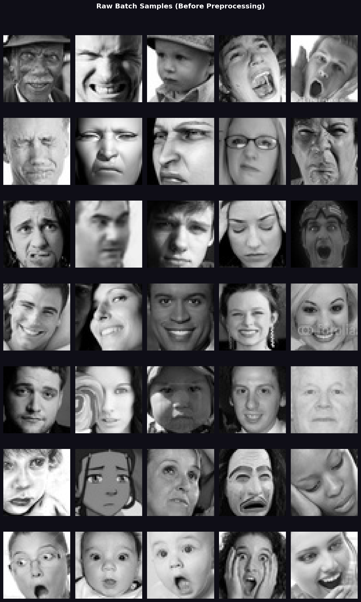
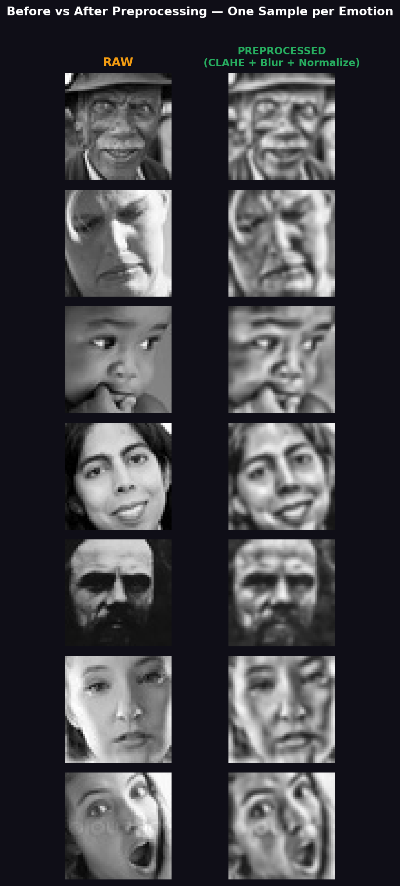

# FER2013 — Phase 1 Analytic Report
**Real Kaggle Dataset | Batch: 210 images | Seed: 42**

---

## Analytics Dashboard

---

## 1. Dataset Overview

| Metric | Value |
|--------|-------|
| Full training set | **28,709 images** |
| Emotion classes | **7** |
| Batch selected | **210 images** |
| Sampling ratio | **0.73% of training set** |
| Usable images | **210 / 210 (100%)** |
| Flagged / corrupt | **0** |
| Batch per class | **30 images (perfectly stratified)** |

---

## 2. Full Dataset Class Imbalance

| Emotion  | Full Dataset | Batch Sampled | Sample %  |
|----------|-------------|--------------|-----------|
| Angry    | 3,995       | 30           | 0.75%     |
| Disgust  | **436**     | 30           | **6.88%** |
| Fear     | 4,097       | 30           | 0.73%     |
| Happy    | **7,215**   | 30           | 0.42%     |
| Neutral  | 4,965       | 30           | 0.60%     |
| Sad      | 4,830       | 30           | 0.62%     |
| Surprise | 3,171       | 30           | 0.95%     |

> **Warning — Critical class imbalance:** `Happy` (7,215) has **16.6x more samples** than `Disgust` (436).
> This must be addressed in Phase 2 via class weighting, oversampling, or data augmentation.

---

## 3. Brightness Statistics per Class

| Emotion  | Avg Brightness | Avg Contrast (Std) | Observation                          |
|----------|---------------|-------------------|--------------------------------------|
| Angry    | 126.2         | 52.4              | Slightly darker faces                |
| Disgust  | 136.4         | 59.4              | Higher contrast                      |
| Fear     | 130.9         | **59.9**          | Highest contrast — most variation    |
| Happy    | 129.5         | 49.6              | Consistent, lower contrast           |
| Neutral  | 124.9         | 57.5              | Darker on average                    |
| Sad      | 124.9         | 51.4              | Similar to neutral                   |
| Surprise | **158.6**     | 51.2              | Brightest class — open eyes/mouth    |

**Batch-wide brightness:**
- Range: `34.5 - 219.4`
- Mean:  `133.1`
- Std:   `34.4` — healthy spread, no cluster near extremes

---

## 4. Image Quality Validation

| Check                   | Result       |
|-------------------------|--------------|
| All images loadable     | Yes          |
| All images 48 x 48 px   | Yes          |
| All images grayscale    | Yes          |
| Corrupt files           | None         |
| Too-dark images (< 10)  | None         |
| Too-bright images (>245)| None         |
| Blank/uniform images    | None         |
| **Overall usability**   | **100%**     |

---

## 5. Preprocessing Validation

After the full pipeline (CLAHE + Gaussian blur + normalization):

| Metric           | Value             |
|------------------|-------------------|
| Output dtype     | `float32`         |
| Output shape     | `(210, 48, 48)`   |
| Pixel range      | `[0.047, 1.000]`  |
| Mean pixel value | `0.541`           |
| Std pixel value  | `0.206`           |

The higher std (0.206) compared to raw confirms **CLAHE successfully enhanced contrast diversity** — important for model generalization.

---

## 6. Sample Visualizations

### Raw Samples (Before Preprocessing)

### Before vs After Preprocessing

### Pixel Intensity Histograms (Post-Preprocessing)

### Brightness Distribution per Class

---

## 7. Key Findings & Recommendations

| # | Finding | Recommendation |
|---|---------|----------------|
| 1 | Disgust severely underrepresented (436 vs 7,215 Happy) | Use augmentation/class weighting in Phase 2 |
| 2 | Surprise is the brightest class (avg 158.6) | Monitor brightness-based normalization effects |
| 3 | Fear & Disgust have highest contrast (~59 std) | Most textured/expressive faces — good for training |
| 4 | Zero corrupt or unusable images | Dataset is clean — no filtering needed |
| 5 | Stratified batch ensures fair class evaluation | Good baseline for Phase 1 |
